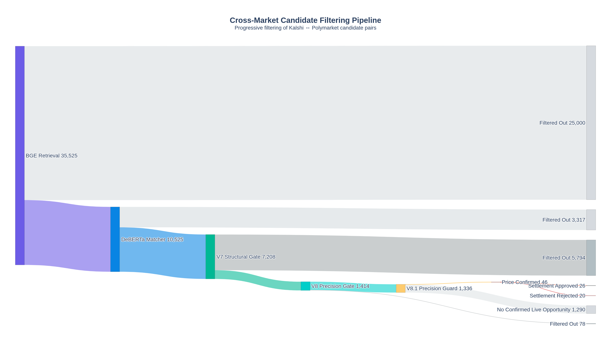
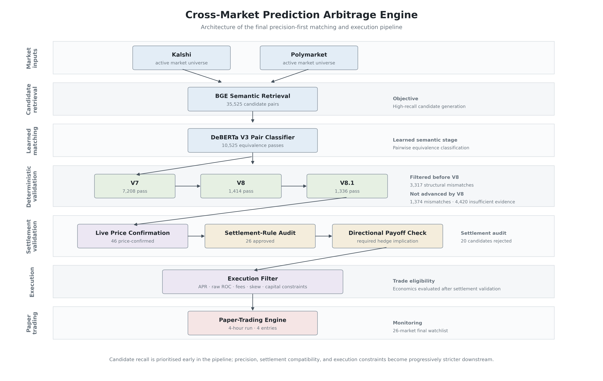
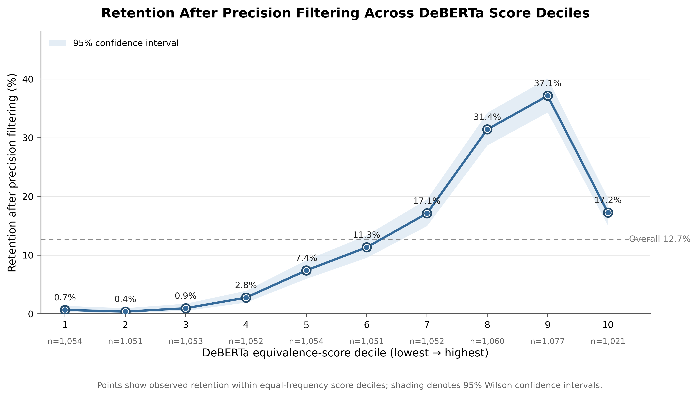
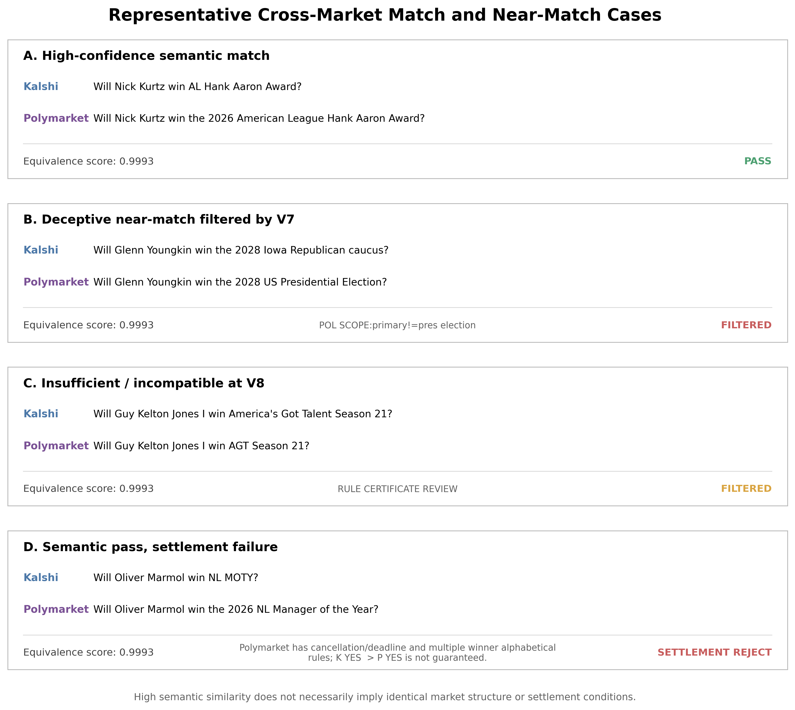
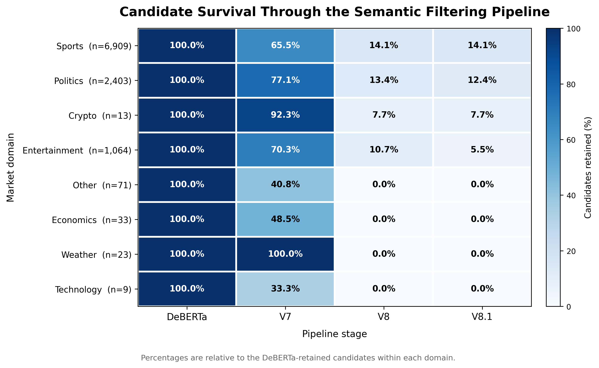
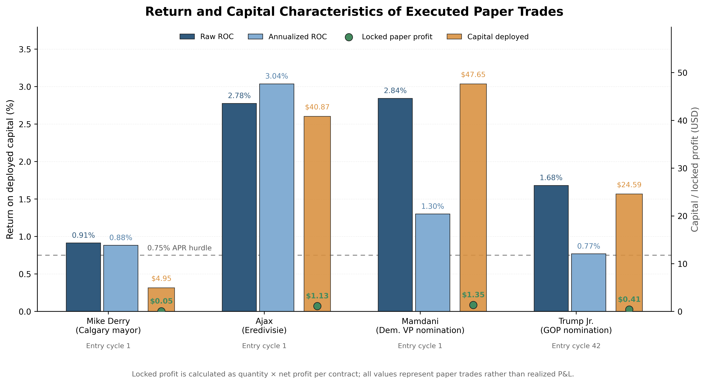
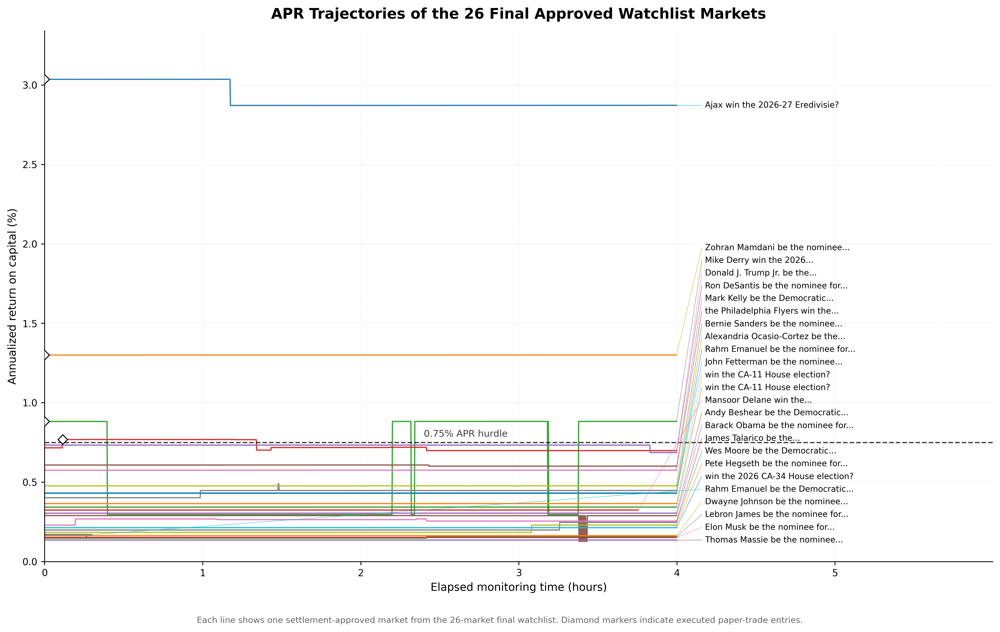
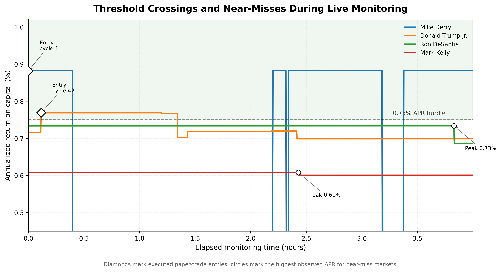
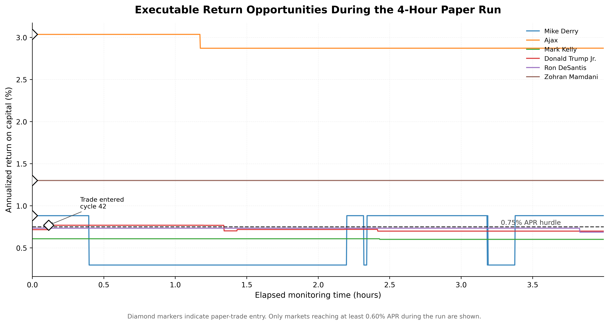

# Cross-Market Prediction Arbitrage Engine
This is a precision first engine for identifying and trading cross-market arbitrage opportunities between Kalshi and Polymarket using a semantic pair filtration system, live pricing and execution conscious return filters.

## Overview

This project focuses on identifying economically equivalent contracts listed on different prediction markets and then monitoring them in real time to detect any price changes which would cause arbitrage opportunities, guaranteeing a profit if done correctly.

The largest challenge in the project was certainly the contract matching, as a single false positive in pair evaluation meant a false arbitrage would likely undo any of the marginal profits made by genuine opportunities. Rigorous evaluation would be required to ensure any contracts matched were perfectly identical, beyond simply their titles but also including the platform specific clauses.

The system combines a trained semantic recognition model and layers deterministic precision filters for extremely high matching accuracy. These pairs are then checked for verification based on their settlement rules, with the passed pairs being checked for financial promise and watch-listed to be monitored over a longer cycle.

## Project Motivation

The idea originally began as a simple Kalshi-only arbitrage engine, and while genuine pricing errors could be detected they were rare and offered extremely low returns after fees. This form of arbitrage detection is also not viable in the long run as prediction markets may ban users placing such suspicious orders. This led me to using the other largest prediction market, polymarket, as a source for cross-market opportunities.

In theory, if I can buy opposing outcomes across the two platforms for less than the guaranteed settlement payout, the difference represents an arbitrage opportunity. However two contracts can look almost identical while differing in settlement date, event definition, cancellation rules, eligible outcomes, geographical scope, competition stage, or resolution procedure. This meant the project focus shifted away from simply finding price discrepancies, and towards building a system that could determine if two contracts were genuinely compatible enough to trade as a hedge.

## System Architecture

Although many designs were tested, this was the final architecture chosen for its near perfect pairing precision and relatively high recall.

## Market Matching Pipeline

### 1. Candidate Retrieval with BGE Embeddings

The first big problem was the scale, comparing each kalshi market against every active polymarket market directly would have a N^2 time complexity which would obviously not be viable with thousands of markets on each side. To avoid this, I used BGE
sentence embeddings as a semantic retrieval layer. This BGE method converts sentences into high-deminsional vectors to group similar topic sentences together, this method would not be accurate enough to determine exact matches however it helps to narrow the search space for more precise pair analysis.

In the final run, this retrieval stage produced over 35,000 candidate pairs, all to be passed to the next classifier.

### 2. Pairwise Equivalence Classification with DeBERTa

This stage was the main learned component of the system.

This more complex model would be useful for distinguishing between contracts that are topically similar and contracts which represent the same proposition. This is especially useful here, as with so many contracts, there are bound to be pairs which refer to the same person and result but differ in context which would be easily missed by many systems.

The final production classifier used Microsoft's DeBERTa-v3 base, giving these results when tested on a sample of 700 pairs.

| Metric | Validation Result |
|---|---:|
| Accuracy | **89.99%** |
| Precision | **100.00%** |
| Recall | **75.64%** |
| F1 Score | **86.13%** |
| PR-AUC | **99.89%** |
| ROC-AUC | **99.93%** |
| Validation Loss | **0.4157** |

In the final experiment, it narrowed  the 35,525 candidates down to 10,525 passes. This removed a large amount of obvious noise however there was bound to be some errors so we could not use this result directly to make trades. The high test score could not guarantee each of the ten thousand passes have exactly compatible structure or settlement conditions.

### 3. Deterministic Semantic and Precision Filtering

After DeBERTa, I added deterministic filter focusing structural differences that the model could have missed. This final filtering stack consisted of V7, V8 and a V8.1, allowing me to be absolutely positive that any pair which makes its way through is a complete match.

The V7 acts as a broad structural safeguard. It checks details such as event identity, subject identity, competition, stage, date, structural wording patterns and known mismatch types. This stage was not particularly restrictive, focusing on removing the high confidence contradictions and allowing all plausible candidates to continue.
The V7 reduced the 10,525 candidates to approximately 7,208.

The V8 on the other hand was much stricter. This stage checked a lot of the same things as the V7 while simultaneously checking  extra details like geographical scope, metric, action, time periods and granularity. This stage also had a third outcome beyond pass or reject, an "insufficient evidence" classification, this prevented forced positive decisions if one side of the pair was not as detailed as the other.
Of the now 7,208 candidates, 1,414 passed, 1,374 contained an explicit mismatch and 4,420 had insufficient evidence. This is where the pipeline became deliberately conservative to prevent any risk of mismatch.

The final V8.1 was a precision gaurd added after manually examining the type of false positives which slipped through the previous filters. This removed mismatches such as;
- "become PM" v "be the next PM"
- "next to leave" v "first to leave"
- actor-only v actor-and-programme award markets
- misleading keyword overlap between unrelated metrics

This removed a further 78 candidates leaving 1,336 of the initial 35,000+ pairs remaining.

This process was deliberately biased towards precision rather than recall, as a false negative may mean simply missing the possibility of an arbitrage however a single false positive would indicate a false arbitrage opportunity, leading to exposed risk and completely eliminate the purpose of the project.

I also examined how the filtering stages impacted different prediction-market domains.

## Settlement and Execution Filtering

### Settlement-Rule Verification

Another unexpected finding was that even perfect semantic equivalence is still not enough, even if two contracts describe the exact same thing they may have different rules governing how they actually resolve. For all candidates that survived semantic filtering and later displayed favourable live pricing, I retrieved the settlement rules from both Kalshi and Polymarket. This allowed me to check for differnces including settlement deadlines, cancellation provisions, fallback resolution procedures, event-completion requirements etc.

During the final run this brought the 46 price-confirmed opportunities down to 26 passing watch candidates.

### Live Pricing and Execution Checks

Only after  the semantic and settlement stages could we begin moving into live execution alsysis.
This required the system to evaluate;
- Executable prices
- Platform fees
- Quote timestamp skew
- Available quantity
- Capital lock duration
- Return on capital

It was important to take time into account, as there can be delays between the price being given and when the trade is actually executed, especially when there are multiple people in a virtual queue to do the same trade. This problem was far more prevalent during the initial single market arbitrage project, however became far less impactful here as opportunities are much more frequent.

## Paper-Trading Methodology

For the final test I allowed the 26-market watchlist to be monitored for 4 hours, this is quite a short window considering the focus was to detect such rare occurrences however I was somewhat time-restricted fur to difficulties developing the pair filtration system.

The main execution rules were as follows;

- Minimum raw ROC: 0.25%
- Minimum APR: 0.75%
- Minimum net profit per contract: $0.0025
- Maximum quote skew: 3 seconds
- Maximum contracts per position: 500
- Polling interval: 10 seconds

The entire watchlist was recycled every 10 seconds (1 cycle), with oppurtunities being ranked primarily by annualized return on capital. Once a paper position was entered, the capital was locked until the end of the four hour run.

## Results

A total of four trades were made, with three of them being identified in the very first cycle meaning the opportunities were likely open for hours.

| Market | Strategy | Entry APR | Raw ROC | Capital Deployed | Locked Paper Profit |
|---|---|---:|---:|---:|---:|
| Ajax | Kalshi YES + Polymarket NO | **3.04%** | **2.78%** | **$40.87** | **$1.13** |
| Zohran Mamdani | Kalshi YES + Polymarket NO | **1.30%** | **2.84%** | **$47.65** | **$1.35** |
| Mike Derry | Kalshi YES + Polymarket NO | **0.88%** | **0.91%** | **$4.95** | **$0.05** |
| Donald Trump Jr. | Kalshi NO + Polymarket YES | **0.77%** | **1.68%** | **$24.59** | **$0.41** |

| Portfolio Metric | Result |
|---|---:|
| Capital Deployed | **$118.05** |
| Locked Paper Profit | **$2.95** |
| Raw Return on Deployed Capital | **~2.50%** |

These final results were less profitable than expected, however this is likely due to the strict nature of the semantic filters, as it's likely that only a fraction of the actual opportunities were actually observed. A positive takeaway however is that despite the over 35,000 initial pairs, the system successfully autonomously identified every single false positive.

## Live Opportunity Behaviour

The entire 26 market watchlist was monitored during the run , with only four of these ever crossing the 0.75% APR threshold. As most of these contracts described events not due to happen in the short term (such as 2028 elections), the prices were not extremely volatile during the four hour run, due to a lack of market or media activity at this early stage. A much longer run of days or weeks would allow a higher threshold to be used as real life events which relate to the contracts could cause large opportunities to appear.

Many of the events had no price change at all during the 4 hour window

## Limitations

The biggest limitation was that the final system may have become too conservative. I intentionally prioritised precision because of how impactful false-positive matches would've been in the system, this led me to adding the V7, V8 and V8.1 rule based filters. The V8 in particular however was extremely selective in what it let through, which surely eliminated a large portion of the potential arbitrage opportunities.

The final settlement filtering also essentially halved the tradeable candidates to prevent any contract clauses from risking a loss, going from 46 to 26 opportunities.

The live monitoring period also only lasted for 4 hours, so the observed opportunity set cannot be assumed to represent normal market conditions across longer periods. The capital deployed in this final test was only simulated rather than submitted to a either exchange, live capital was not deployed due to jurisdiction-dependent restrictions and compliance requirements across prediction markets as I didn't want this to impact the technical-focused aspect of the project. Despite already accounting for some of the trading latency in this project, I suspect there could easily be additional hurdles such as partial fills or simple operational error which are difficult to account for if real capital was used.

Finally the annualized returns of the final positions were relatively low. The projects failed to demonstrate how this "risk-free strategy" could outperform the more traditional investments. This result was clear evidence of the trade off between protecting the system against basis risk and being able to monitor all opportunities.

## Future Work

If I were to continue 

## Repository Structure

## Setup and Usage

## Technologies Used
